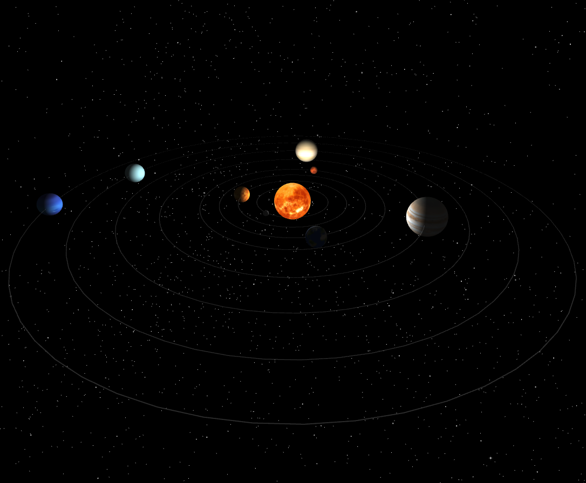

---

# 3D Solar System with Three.js

This project is a 3D solar system built using [Three.js](https://threejs.org/). It features an interactive solar system where users can zoom in for a closer view, and rotating around the system in a 360-degree view.

## Features

- **Realistic Solar System**: The project simulates the solar system with planets orbiting around the sun.
- **Customizable**: Easily replace textures and tweak parameters to create your own 3D scenes.
- **Responsive Design**: The layout adjusts to different screen sizes, ensuring a consistent experience across devices.

<div align="center">
  
</div>

## Getting Started

### Prerequisites

- A basic understanding of HTML, CSS, and JavaScript.
- [Node.js](https://nodejs.org/) installed (optional, if using a local server).

### Installation

1. Clone the repository:
   ```sh
   git clone https://github.com/your-username/3d-portfolio-threejs.git
   cd 3d-portfolio-threejs
   ```

2. Add the required textures for the planets and the sun in a `textures` directory within the root of the project.

3. Open the `index.html` file in your preferred browser.

   Alternatively, you can use a local server (e.g., with VS Code's Live Server extension) to view the project.

### Project Structure

- **`index.html`**: The main HTML file that sets up the basic structure of the page and includes the Three.js library and custom scripts.
- **`styles.css`**: Contains the styles for the project, ensuring a responsive design.
- **`script.js`**: The core JavaScript file where the Three.js scene is created, planets are added, and interactivity is handled.

### Customization

- **Textures**: Replace the textures in the `textures` directory to customize the appearance of the planets and the sun.
- **Camera Settings**: Adjust the camera's initial position and zoom speed in the `script.js` file.
- **Planet Data**: Modify the `planetData` array in `script.js` to change the properties of the planets, such as size, distance from the sun, rotation speed, and textures.

### Controls

- **Zoom**: Scroll to zoom in and out.
- **Rotate**: Click and drag to rotate the camera around the solar system.

---
